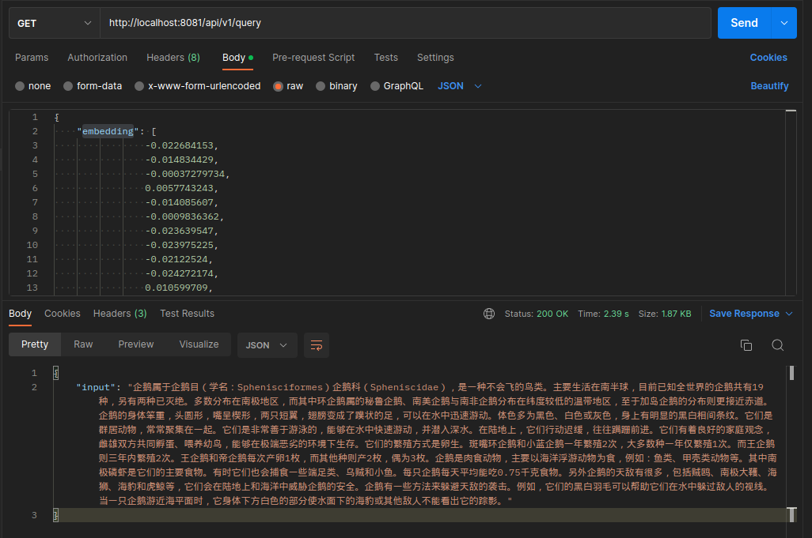

# Pinecone 项目总结

Pinecone 项目是一个简单的 Go 语言 HTTP 服务，它提供了四个 API 接口：`/api/v1/healthcheck`、`/api/v1/echo`、`/api/v1/index` 和 `/api/v1/query`。当服务启动时，它会打印一条日志，表示服务已经启动。当服务收到请求时，它会打印一条日志，表示收到了请求。当服务启动失败时，它会打印一条日志，表示启动服务失败，并输出错误信息。当服务停止时，它会打印一条日志，表示服务已经停止。当用户手动停止服务时，它会打印一条日志，表示用户已经终止服务。

在 `main()` 函数中，我们首先使用 `log.Println` 函数打印一条日志，表示服务已经启动。然后，我们使用 `http.HandleFunc` 函数注册四个处理函数，分别处理 `/api/v1/healthcheck`、`/api/v1/echo`、`/api/v1/index` 和 `/api/v1/query` 接口的请求。接着，我们创建一个信号通道，并使用 `signal.Notify` 函数监听 `SIGINT` 信号。然后，我们使用 `go` 语句启动一个 HTTP 服务器，并在其中使用 `http.ListenAndServe` 函数监听 8080 端口。如果启动失败，我们使用 `log.Fatal` 函数打印一条日志，表示启动服务失败，并输出错误信息。最后，我们使用 `<-sigChan` 语句等待 `SIGINT` 信号，当收到信号时，我们使用 `log.Println` 函数打印一条日志，表示服务已经停止。

在 `api` 包中，我们定义了四个处理函数：`HealthCheck`、`PrintEcho`、`GetIndexName` 和 `QueryIndex`。`HealthCheck` 函数返回一个字符串 `"OK"`，表示服务正常运行。`PrintEcho` 函数接收一个字符串参数，并返回一个字符串，表示接收到的字符串。`GetIndexName` 函数返回一个字符串，表示当前索引的名称。`QueryIndex` 函数接收一个字符串参数，并返回一个字符串，表示查询到的结果。在 `main()` 函数中，我们使用 `http.HandleFunc` 函数将这四个处理函数注册到 HTTP 服务器的路由中，以便处理 `/api/v1/healthcheck`、`/api/v1/echo`、`/api/v1/index` 和 `/api/v1/query` 接口的请求。

总的来说，Pinecone 项目是一个简单的 Go 语言 HTTP 服务，它提供了四个 API 接口，并使用日志记录服务的启动、停止和请求等信息。这个项目可以作为一个基础模板，用于构建更复杂的 Go 语言 HTTP 服务。